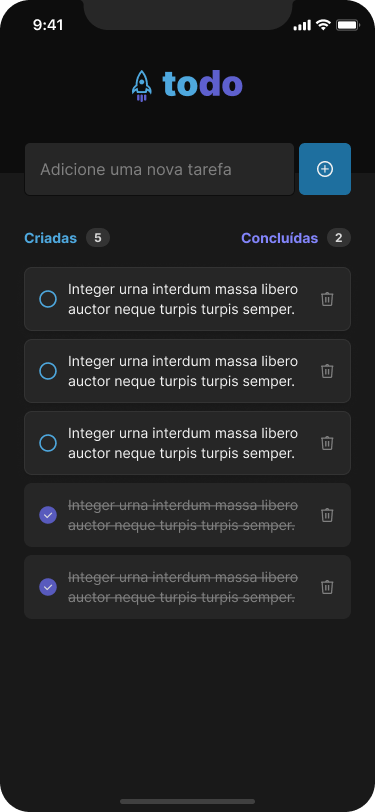

# To Do List

O To Do List é um aplicativo simples e intuitivo de lista de tarefas desenvolvido em Expo React Native com TypeScript. Ele oferece uma maneira eficiente de organizar suas tarefas diárias, permitindo que você as crie, marque como concluídas e as exclua com facilidade.

## 💻 Pré-requisitos

Antes de começar, verifique se você atendeu aos seguintes requisitos:

- Você instalou a versão mais recente do gerenciador de pacotes `yarn`
- Você tem uma máquina com emulador android ou ios instalado, ou alternativamente possui um aparelho físico com o aplicativo `Expo Go` instalado

## 🚀 Rodando o projeto
    1. Clone o repositório.
    2. Dentro do diretório do projetem instale as dependências com o comando yarn.
    3. Dentro do diretório do projeto, execute o projeto com o comando yarn start.   
    4. Siga as intruções do terminal para conectar com o emulador ou dispositivo físico.

## 📫 Contribuições
Sinta-se à vontade para contribuir com melhorias ou correções neste projeto. Crie um fork do repositório, faça suas alterações e envie um pull request. Estamos abertos a sugestões!

---
**Desenvolvido por Lizandra Malta - github.com/lizandramalta**

_Este projeto foi desenvolvido como parte do desafio proposto pela Rocketseat._
